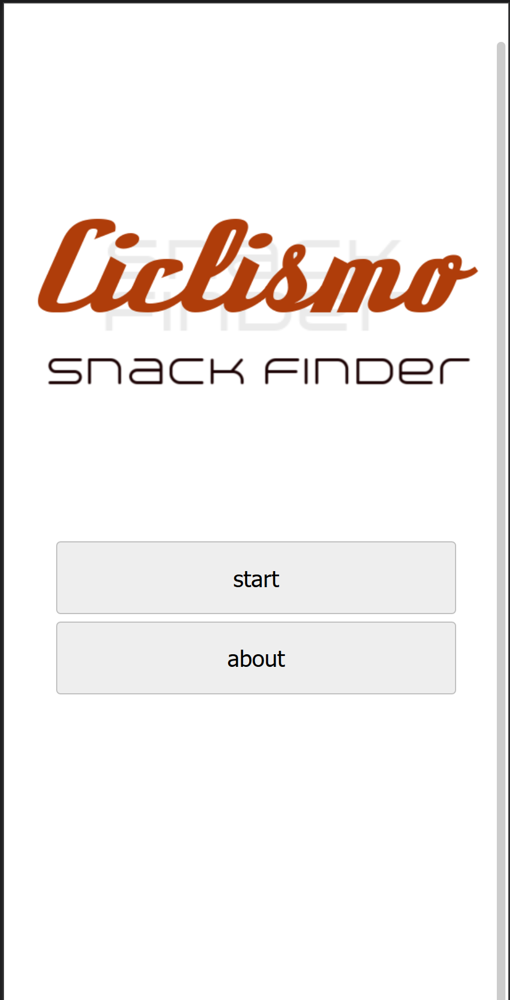
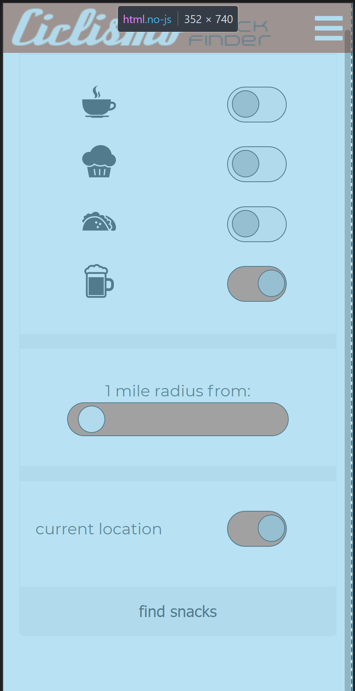
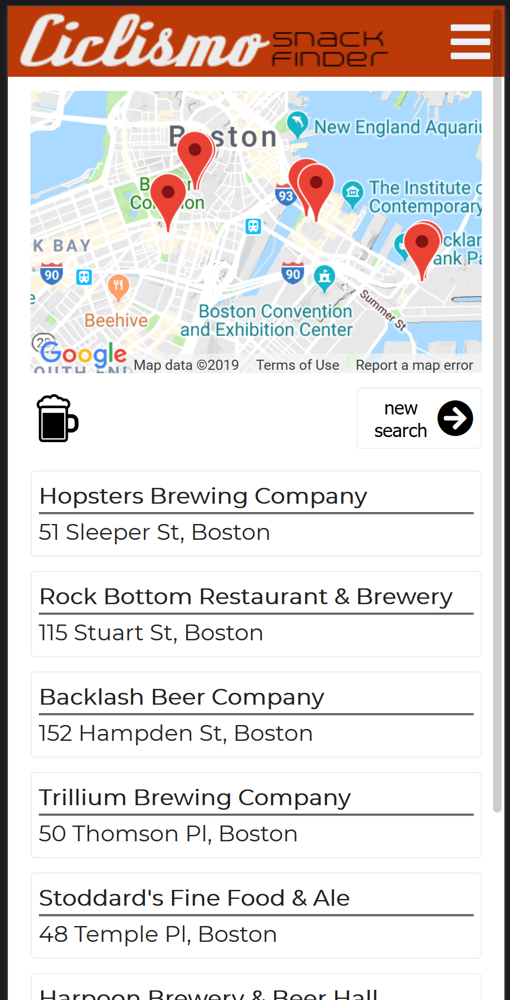

Ciclismo Snack Finder

http://ciclismosnackfinder.com

What is Ciclismo Snack Finder?

Snacks are a quintessential part of cycling culture. Grabbing a pre-ride coffee, mid-ride scone, or post-ride tacos and beer can often be just as important as the ride itself. 

Snack finder's goal is to help locate quality snacks to fill this essential need. This is done by leveraging Google's APIs along with specific keywords to target independent style establishments with artisan coffee, micro brews, or street tacos.

Key Technologies:

HTML5
Javascipt
JQuery
CSS

